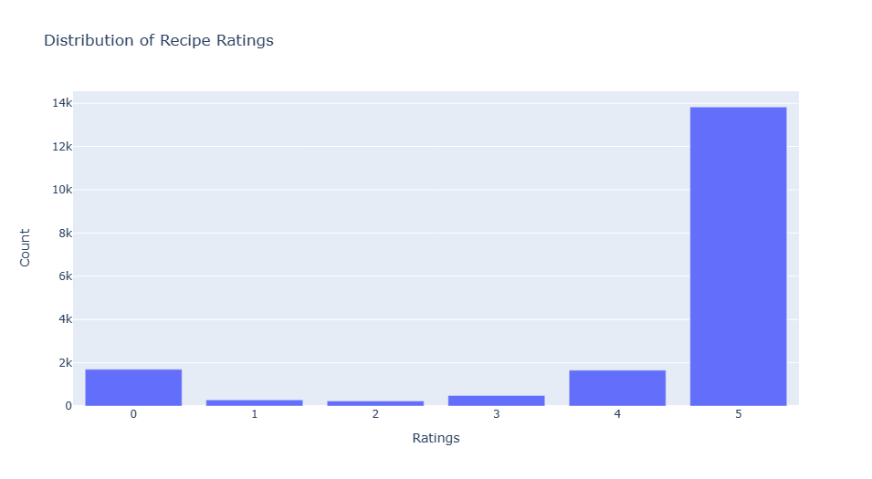
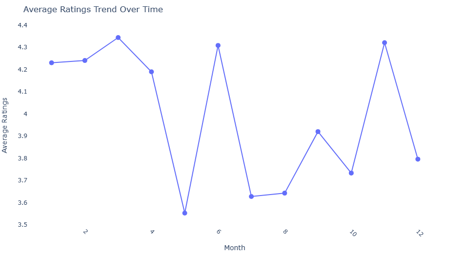
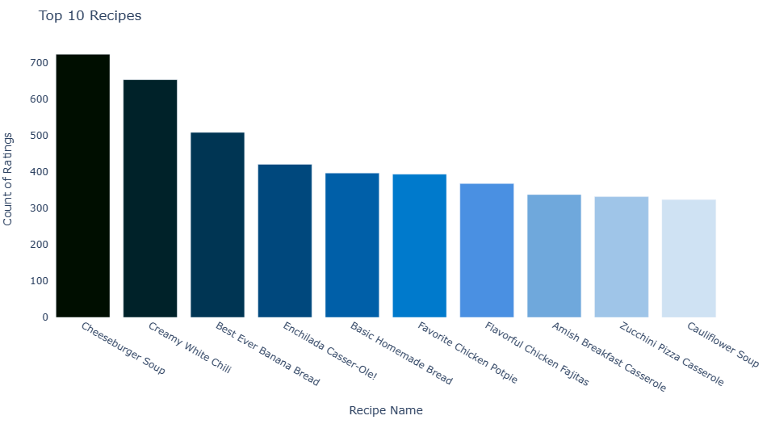
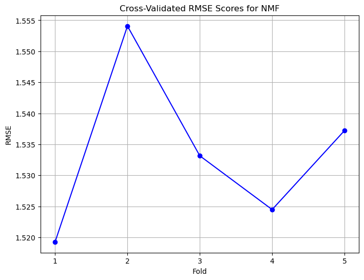
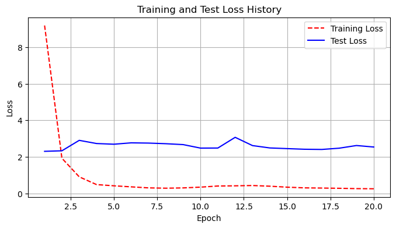

# Data Dining Delight 

# A Recipe Recommender System

**Authors:** 

[Ann Karuga](https://github.com/Annkaruga)

[Rodgers Bunde](https://github.com/rodgersbunde)

[Linah Ogumbeh](https://github.com/OLinahM)

[Joan Wambua](https://github.com/JoanWambua)

[Rhoda Musyoki](https://github.com/Rhod-sy)


## Project Overview

This project aims to enhance the culinary experience on online platforms by analyzing the 'Recipe Reviews and User Feedback Dataset'. The goal is to understand user behavior and preferences through recipe reviews, ratings, and interactions, and use this information to develop a personalized recipe recommendation system. The system will suggest recipes tailored to each user's tastes and preferences using collaborative filtering and content-based filtering techniques. Additionally, an intuitive and user-friendly interface will be developed for users to easily browse recipes, read reviews, and receive recommendations. This initiative is in response to Bay Bistro food company's desire to boost user engagement and satisfaction on its recipe platform.


## Data Understanding

The data sources for this analysis include the UC Irvine Machine Learning Repository and GPT AI.

***
Datasets Used:

1. Recipe Reviews and User Feedback Dataset: a comprehensive repository of data encompassing various aspects of recipe reviews and user interactions. It includes essential information such as the recipe name, its ranking on the top 100 recipes list, a unique recipe code, and user details like user ID, user name, and an internal user reputation score. Each review comment is uniquely identified with a comment ID and comes with additional attributes, including the creation timestamp, reply count, and the number of up-votes and down-votes received. Users' sentiment towards recipes is quantified on a 1 to 5 star rating scale, with a score of 0 denoting an absence of rating.

2. Recipe Ingredients and Cooking Instructions Dataset: This dataset provides ingredients and cooking instructions for the recipes contained in the 'Recipe Reviews and User Feedback Dataset'. These two features were generated using GPT AI.
***


## Preprocessing & EDA

Data Loading: The data was loaded from two CSV files: ‘Recipe.csv’ and ‘ingredients.csv’. The first file contains user comments on recipes, and the second file contains the ingredients and cooking instructions for each recipe.

Data Cleaning: The data cleaning process involved four main steps which checked for: Completeness, Consistency, Validity and Uniformity.

Feature Engineering: The two dataframes were merged on the ‘recipe_name’ column. The ‘stars’ column was renamed to ‘ratings’. A new ‘month’ column was created from the ‘created_at’ column. An ‘average_rating’ column was created with the calculated mean value of the ‘ratings’ column.











## Model Training and Prediction

This project uses three recommendation techniques: Item-Based Collaborative Filtering, User-Based Collaborative Filtering and Single Value Decomposition (SVD).

**Item-Based Collaborative Filtering:** This technique focuses on the similarity between items rather than users. 

**User-Based Collaborative Filtering:** This technique provides personalized recommendations to users. 

**Single Value Decomposition (SVD):** SVD is a dimensionality reduction technique that provides a compact representation of user-item interactions.

The models were trained using a surprise dataset converted from the provided DataFrame. The dataset was split into training and testing sets and the models were fit using the training set. Predictions were made for the test set, and the RMSE and MAE were calculated to evaluate the models’ performance.

Recommendations were generated using SVD by predicting ratings for each recipe for a specific user and sorting the ratings in descending order. The top-rated recipes were recommended to the user.

Hyperparameter tuning is performed using GridSearchCV from the Surprise library to find the best parameters for the SVD model. The model is then retrained using these parameters and used to generate top-10 recipe recommendations for each user. 

Additionally, Non-negative Matrix Factorization (NMF), a matrix factorization technique that factors the user-item interaction matrix into non-negative matrices, was used. 

The estimated ratings are numerical values generated by the models, representing how much the models predict the user would like each recipe. Higher estimated ratings indicate recipes that the models believe the user is more likely to enjoy or rate highly. These recommendations help users discover popular and potentially enjoyable recipes, enhancing user engagement and satisfaction with the recipe platform or service.

Neural Collaborative Filtering Model with Matrix Factorization and Embedding Layer: This model takes user and recipe IDs, converts them into embeddings, concatenates these embeddings, passes them through dense layers, and finally predicts a rating. The model’s performance is evaluated using a custom RMSE metric.

For each model, top-10 recipe recommendations are generated for each user based on the predicted ratings. The predicted ratings are sorted in descending order to identify the top 10 recipes that the user is most likely to enjoy.








## Evaluation

The models are evaluated using two metrics: Root Mean Square Error (RMSE) and Mean Absolute Error (MAE).

**Item-Based Collaborative Filtering:** The reported RMSE and MAE suggest that the model performs reasonably well.

**User-Based Collaborative Filtering:** The RMSE and MAE values indicate that the model’s predictions deviate from the actual values by about 1.5642 units on average, and the absolute difference between the model’s predictions and the actual values is 0.9911 units on average.

**Single Value Decomposition (SVD):** The reported RMSE and MAE suggest that the SVD model is performing reasonably well, with an average deviation of about 1.4522 units from the actual values and an average absolute difference of 0.9920 units.

**Non-negative Matrix Factorization (NMF):** The NMF algorithm has an average RMSE of approximately 1.5308 and an average MAE of approximately 1.0460 across the 5 folds. The model takes an average of 1.48 seconds to fit and 0.03 seconds to test on each fold. The top 5 recommended recipes for a specific user were also generated based on ratings.

**Matrix Factorization with Embedding Layer:** This model uses embeddings to capture latent features that represent users’ preferences and items’ characteristics. The model is relatively large due to the high number of parameters, especially in the embedding layers.

**Neural Collaborative Filtering Model:** This model combines the strengths of Collaborative Filtering and Deep Learning. It takes user and recipe IDs, converts them into embeddings, concatenates these embeddings, passes them through dense layers, and finally predicts a rating.


## Deployment

This application utilizes Streamlit, a framework for creating web applications with Python, to deploy the Recipe Search App. The app allows users to search for recipes using a machine learning model for recommendations based on inputted recipe names.

Features:
**Search Functionality:** Users can input recipe names to search for and get recommendations along with ingredient lists and ratings.

**Navigation Sidebar:** The app includes a navigation sidebar for easy access to Home, About, and Results pages.

**Custom Styling:** Custom colors and styling have been applied to enhance the visual appeal of the app.

Deployment:
**Streamlit:** Streamlit is used as the deployment framework, providing a straightforward way to turn Python scripts into shareable web apps.
**Pickle:** Pickle is utilized to load pre-trained machine learning models and data for recipe recommendations.

Home: Welcome page providing an overview of the app.
About: Information about the app and how it works.
Results: Displays recipe search results, including ingredient lists and ratings based on user input.
Simply run the provided Python script to start the Streamlit server and access the Recipe Search App in your web browser.


## Future Steps

1. Data Expansion: Incorporate broader datasets to deepen recipe analysis and improve recommendation accuracy.
2. User Interface Improvement: For easier navigation and enhanced interaction with recipe recommendations.
3. Ongoing Evaluation: Regularly update and refine the system 


## Recommendations

- Integrate real-time feedback for better engagement
- Utilize machine learning to tailor recipe suggestions
- Implement natural language processing algorithms to analyze user reviews and sentiments
- Categorize/ cluster the recipes for diverse preferences
- Allow users to contribute to recipe tagging
- Improve UI with visual cues for navigation and explorationof recipes
 

## For More Information

See the full analysis in the [Jupyter Notebook](./capstone_project.ipynb) or review this [Project Presentation](./capstone_project-presentation.pdf)


## Repository Structure

```
├── Charts 
├── Data
├── Capstone-Project
├── data dining delight - ppt presentation.pdf
└── ReadMe.md
```
